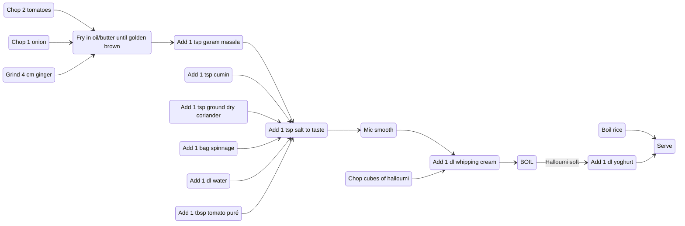

# Recipie Flow Charts
Visual recipies for engineers.

## Miriam's Pallack Paneer
Green stew with curry and halloumi, served with rice.

```mermaid
stateDiagram-v2
direction LR

BOIL_RICE : Boil rice
SERVE : Serve
BOIL_RICE --> SERVE

TOMATOES : Chop 2 tomatoes

TOMATOES --> FRY
ONION : Chop 1 onion

ONION --> FRY
GINGER : Grind 4 cm ginger

GINGER --> FRY
FRY : Fry in oil/butter until golden brown

GARAM_MASALA : Add 1 tsp garam masala
FRY --> GARAM_MASALA

CUMIN : Add 1 tsp cumin

CORIANDER : Add 1 tsp ground dry coriander

SPINNAGE : Add 1 bag spinnage

WATER : Add 1 dl water

TOMATO_PURE : Add 1 tbsp tomato puré

SALT : Add 1 tsp salt to taste
GARAM_MASALA --> SALT
CUMIN --> SALT
CORIANDER --> SALT
SPINNAGE --> SALT
WATER --> SALT
TOMATO_PURE --> SALT

MIX : Mic smooth
SALT --> MIX

CREAM : Add 1 dl whipping cream
MIX --> CREAM
HALOUMI : Chop cubes of halloumi
HALOUMI --> CREAM

CREAM --> BOIL
YOGHURT : Add 1 dl yoghurt
BOIL --> YOGHURT : Halloumi soft
YOGHURT --> SERVE


```